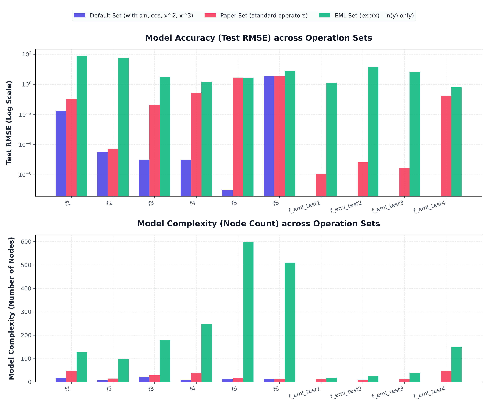
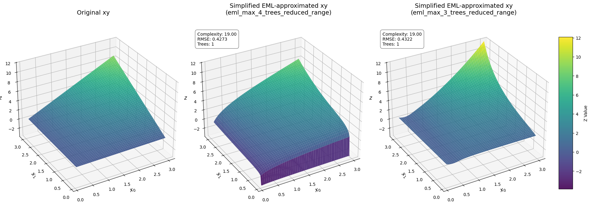
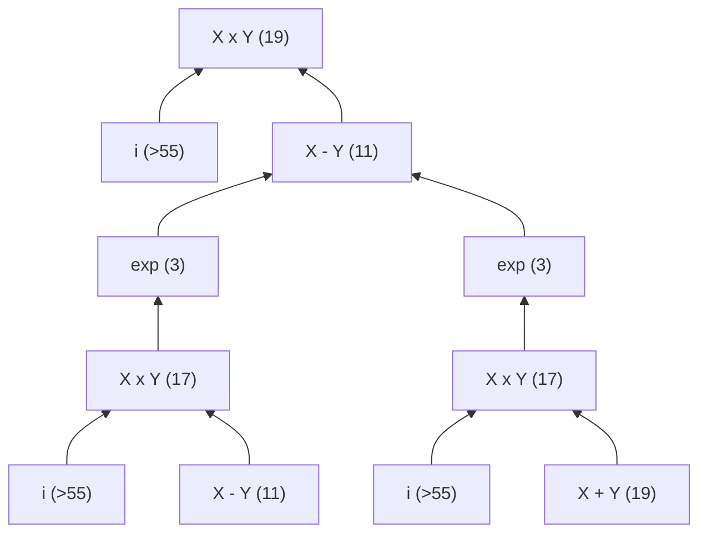
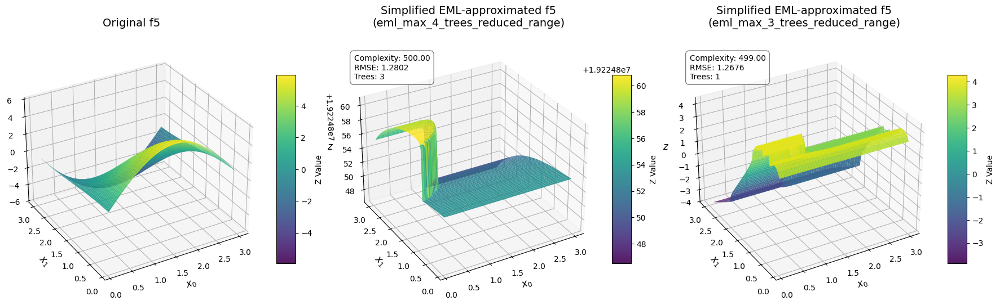
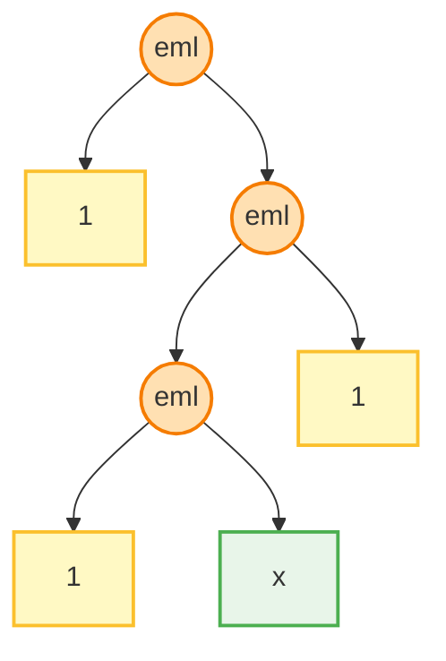
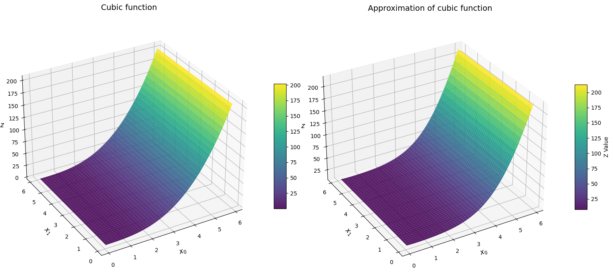

<br>
<h1 align="center">Bayesian Symbolic Regression on EML-Trees</h1>
<h3 align="center">A Program Synthesis Study Project</h3>
<br>

> This repository contains a project developed as part of my Master’s degree program in AI at Poznań University of Technology (PUT).
> *Poznań, 2026*


# Project Context and Objectives
This project is based on two primary papers:
* `"Bayesian Symbolic Regression"` (Jin et al., 2020, [arXiv:1910.08892](https://arxiv.org/abs/1910.08892))
* `"All elementary functions from a single operator"` (Odrzywołek, 2026, [arXiv:2603.21852](https://arxiv.org/abs/2603.21852))

The objective is to analyze the performance, limitations, and optimization characteristics of restricting the symbolic regression operator set to the single binary **EML operator** and unity within the Bayesian Symbolic Regression (BSR) framework ([ORIGINAL_README.md](./ORIGINAL_README.md)).

Full comprehensive yet less structured version of this report can be found here: [extended_report.md](./extended_report.md)


<div style="break-after: page;"></div>


# A Bit of Theory
## Foundations of Symbolic Regression

### Symbolic Regression (SR)
Symbolic regression searches the space of mathematical expressions to discover a model that best fits a dataset, balancing accuracy and complexity without assuming a pre-specified model shape:
* Syntax trees represent mathematical expressions. While standard operator sets mix binary and unary branches, the EML set produces strictly binary trees.
* The following operation sets are compared in this study:
  * **Original Paper Set (`paper`):** 
```math
\Omega_{paper} = \{+,\ \times,\ \exp(x),\ inv(x):=1/x,\ neg(x):=-x,\ lt_{a,b}(x):=ax+b\}
```

  * **Extended Set (`default`):** 
```math
\Omega_{EML} = \{1,\ eml(x,y):=\exp(x)-\ln(y)\}
```
  * **EML Set (`exp_log`):**
```math
\Omega_{EML} = \{1,\ eml(x,y):=\exp(x)-\ln(y)\}
```

### Theoretical Comparison: BSR vs. Kolmogorov-Arnold
* **Bayesian SR (BSR)** models the output as a linear combination of symbolic trees:
  ```math
  y = \beta_0 + \sum_{i=1}^{k} \beta_i \cdot T_i(x) + \epsilon
  ```
* **Kolmogorov-Arnold Representation** decomposes multivariate functions into nested sums of continuous univariate functions:
  ```math
  f(x_1, \dots, x_n) = \sum_{q=0}^{2n} \Phi_q \left( \sum_{p=1}^n \phi_{q,p}(x_p) \right)
  ```

While both use outer addition ($+$) to aggregate subfunctions, BSR focuses on finding discrete, human-interpretable algebraic equations rather than continuous network layers.


<div style="break-after: page;"></div>


## Bayesian Symbolic Regression (BSR) Mechanics

* The overall response variable $y$ **aggregates** $k$ independent symbolic trees via an Ordinary Least Squares (OLS) fitting pipeline:
```math
y=\text{OLS}\left(x, \{(T_i, M_i, \Theta_i)\}_{i=1}^{k}\right) + \epsilon, \quad \epsilon \sim N(0, \sigma^2)
```
* BSR uses structural complexity **priors** on trees ($T$) to penalize deep or wide topologies and avoid overfitting.
* **Parametrization:** For `default` and `paper` sets, linear scaling nodes ($ax+b$) are tuned using Gaussian priors around the identity function. For the final model, tree weights ($\beta_i$) and the global intercept ($\beta_0$) are solved jointly using Ordinary Least Squares (OLS).
* **Metropolis-Hastings Sampling -** structural exploration iteratively samples modified tree topologies from a proposal distribution, accepting or rejecting structural changes sequentially
* **Search Algorithm:** BSR uses Reversible Jump MCMC (RJMCMC) to propose and evaluate structural changes (splits, prunes, swaps) across models of varying parameter dimensions, updating the noise scale $\sigma^2$ continuously.

## EML Basis & Complex Plane

The EML operator provides a functional framework capable of representing every elementary mathematical function.
* **Completeness:** The $\{\text{EML}, 1\}$ set is functionally complete. Over the complex plane, negative arguments allow standard trigonometric and hyperbolic functions to be represented as complex exponential configurations via Euler's identity:
```math
\cos(x) = \frac{e^{ix} + e^{-ix}}{2}, \quad \sin(x) = \frac{e^{ix} - e^{-ix}}{2i}
```


<div style="break-after: page;"></div>

# Experimental Setup and Results

## Benchmark Targets and Domain
The BSR framework was evaluated using three operator sets on:
1. **Benchmark formulas ($f_1$ to $f_6$)** from the original BSR paper:
   - $f_1 := 2.5 x_0 ^4 - 1.3  x_0^3 + 0.5  x_1^2 - 1.7  x_1$
   - $f_2 := 8 x_0 ^ 2 + 8 x_1 ^ 3 - 15$
   - $f_3 := 0.2 x_0 ^ 3 + 0.5 x_1 ^ 3 - 1.2 x_1 - 0.5 x_0$
   - $f_4:= 1.5 \exp(x_0) + 5 \cos(x_1)$
   - $f_5:= 6  \sin(x_0)  \cos(x_1) $
   - $f_6:= 1.35 x_0 x_1 + 5.5 \sin((x_0- 1.0) \cdot (x_1 - 1.0))$
2. **EML-specific test targets** (f<sub>eml_test1</sub> to f<sub>eml_test4</sub>):
   -  $f_{\text{eml\\_test1}} := x_0^2$
   -  $f_{\text{eml\\_test2}} := x_0^3$ 
   -  $f_{\text{eml\\_test3}} :=x_0^2 + x_1^2 + x_0 x_1$
   -  $f_{\text{eml\\_test4}} := \cos(x_0) + \sin(x_1)$ 
3. **Multiplicative and periodic primitives**: 
   - $f_{\text{xy}} := x_0 x_1$
   - $f_{\text{cos}} := \cos(x_0)$

The dataset for standard evaluations consisted of $100$ train and $1000$ test points sampled uniformly. Two domain ranges were compared: the original extended range $x_i \in [0.1, 5.9]$ and a reduced range $x_i \in [0.1, 3.0]$.


<div style="break-after: page;"></div>

## Part 1: Standard Domain Results ($x_i \in [0.1, 5.9]$)
The table below displays the RMSE (Train/Test) and tree complexity ($C$) under a uniform prior on the standard interval (maximum $k=3$ trees).

*Detailed results can be found in the folder [`./experiments/results/final/`](./experiments/results/final/), specifically [`final_run.csv`](./experiments/results/final/final_run.csv) and [`final_run.txt`](./experiments/results/final/final_run.txt)*

#### Benchmark Formulas ($f_1$ to $f_6$)
Numbers in the cells represent RMSE (Train/Test) and **Complexity**.
| Formula | `default` | `paper` | `exp_log` (EML) set |
|---|---|---|---|
| **$f_1$** | $0.01662$ / $0.01751$ <br> **17** | $0.09895$ / $0.10582$ <br> **48** | $62.58167$ / $80.48665$ <br> **127** |
| **$f_2$** |  $3.1 \times 10^{-5}$ / $3.3 \times 10^{-5}$ <br> **8** | $5.5 \times 10^{-5}$ / $5.2 \times 10^{-5}$ <br> **15** | $51.14151$ / $55.53686$ <br> **97** |
| **$f_3$** | $9.6 \times 10^{-6}$ / $1.0 \times 10^{-5}$ <br> **23** | $0.04315$ / $0.04497$ <br> **30** | $2.87591$ / $3.32785$ <br> **179** |
| **$f_4$** |  $1.0 \times 10^{-5}$ / $1.0 \times 10^{-5}$ <br> **10** | $0.16902$ / $0.27851$ <br> **39** | $1.46171$ / $1.54410$ <br> **249** |
| **$f_5$** |  $1.1 \times 10^{-7}$ / $1.0 \times 10^{-7}$ <br> **12** | $2.77454$ / $2.85032$ <br> **17** | $2.60806$ / $2.80786$ <br> **599** |
| **$f_6$** | $3.48422$ / $3.70906$ <br> **13** | $3.20180$ / $3.63576$ <br> **14** | $7.21936$ / $7.36068$ <br> **509** |
| **$f_{\text{eml\\_test1}}$** | | $9.8 \times 10^{-7}$ / $1.1 \times 10^{-6}$ <br> **12** | $0.99891$ / $1.21311$ <br> **19** |
| **$f_{\text{eml\\_test2}}$** | | $6.9 \times 10^{-6}$ / $6.6 \times 10^{-6}$ <br> **10** | $13.46164$ / $14.28857$ <br> **25** |
| **$f_{\text{eml\\_test3}}$** |  | $2.6 \times 10^{-6}$ / $2.9 \times 10^{-6}$ <br> **14** | $6.38797$ / $6.47829$ <br> **37** |
| **$f_{\text{eml\\_test4}}$** |   | $0.14030$ / $0.17403$ <br> **46** | $0.61475$ / $0.62960$ <br> **150** | 


<div style="break-after: page;"></div>

The plot shows a comparative view of the accuracy _Test RMSE_ on a log scale and _model complexity_ on a linear scale across all 10 benchmark formulas:




<div style="break-after: page;"></div>

## Part 2: EML Optimization on Reduced Interval ($x_i \in [0.1, 3.0]$)
To alleviate the extreme numerical sensitivity of EML exponential nesting, a secondary benchmark suite was executed on the reduced interval $[0.1, 3.0]$ using customized hyperparameters:
* **Hyperparameters:** Proposals set to $500$, MCMC iterations set to $96$, structured depth priors, and simulated annealing ($T_{\text{start}} \in [50.0, 300.0]$).
* **Multi-Tree Tuning:** Configured up to 4 trees for $f_1, f_3, f_4, f_5, f_6$, 2 trees for $f_2, f_{\text{cos}}$, and 1 tree for $f_{\text{xy}}$ (matching estimated additive properties).

The best results obtained across these optimized runs are shown below.


| Target Formula | Max Trees | Active Trees | Compl exity | Train RMSE | Test RMSE | Findings |
|---|---|---|---|---|---|--------------|
| **$f_1$** | 4 | 2 | 90 | $0.6137$ | $0.5046$ | Collapsed to 2 active trees (2 died). |
| **$f_2$** | 2 | 2 | 50 | $2.7773$ | $2.6896$ | Fits both polynomial terms smoothly. | 
| **$f_3$** | 4 | 3 | 74 | $0.1253$ | $0.1563$ | Collapsed to 3 active trees (1 died). |
| **$f_4$** | 4 | 3 | 170 | $0.2437$ | $0.2684$ | Reconstructs exponential and cosine terms. |
| **$f_5$** | 4 | 2 | 500 | $1.2299$ | $1.2676$ | Collapsed to 2 active trees (2 died). |
| **$f_6$** | 4 | 2 | 190 | $2.0821$ | $2.0951$ | Collapsed to 2 active trees (2 died). |
| **$f_{\text{xy}}$** | 1 | 1 | 19 | $0.4142$ | $0.4322$ | Approximates multiplication as single tree. |
| **$f_{\text{cos}}$** | 2 | 1 | 160 | $0.2286$ | $0.2451$ | Collapsed to 1 active tree (1 died). |
| **$f_{\text{eml\\_test1}}$** | 1 | 1 | 19 | $0.1458$ | $0.1519$ | Stable quadratic approximation. |
| **$f_{\text{eml\\_test2}}$** | 1 | 1 | 29 | $0.1877$ | $0.1870$ | Stable cubic approximation. |
| **$f_{\text{eml\\_test3}}$** | 3 | 3 | 69 | $0.6966$ | $0.7425$ | Reconstructs 3-tree additive fit. |
| **$f_{\text{eml\\_test4}}$** | 4 | 3 | 150 | $0.1564$ | $0.2188$ | Collapsed to 3 active trees (1 died), poor reconstruction. |

The plot below shows reconstuction of product of 2 numbers (2 attempts):


*Detailed results can be found in [`experiments\results\final\eml_max_3_trees_reduced_range.txt`](.\experiments\results\final\eml_max_3_trees_reduced_range.txt)  and [`eml_max_4_trees_reduced_range.txt`](.\experiments\results\final\eml_max_4_trees_reduced_range.txt) , 
plots of the reconstructed surfaces can be found in the notebook: [Visualisations_EML_on_reduced_interval,_up_to_4_trees.ipynb](./experiments/Visualisations_EML_on_reduced_interval,_up_to_4_trees.ipynb).*


### Intermediate Conclusions

#### Domain Constraints and Hyperparameter Tuning
Reducing the evaluation domain from $5.9$ to $3.0$ combined with highly optimized hyperparameters (beta and complexity constraints, along with simulated annealing and fine-tuned tree priors) yielded a massive accuracy and visual improvement. Under the larger domain, nested exponentials frequently exceed $10^{12}$ and trigger BSR's internal clipping, which flattens the likelihood space and leaves the MCMC sampler stuck. Constraining the domain and tempering the early MCMC search budget helped to avoid this gradient-less space.

#### Impact of the Number of Trees is Negligible
Increasing the allowed number of trees from 3 to 4 does not automatically translate to a better fit or different mathematical behavior as could be expected:
* Because BSR's MCMC steps mutate only one tree at a time, there is **no joint optimization mechanism to coordinate multiple trees**. If the target requires cooperative multi-tree structures, BSR struggles to build them.
* Consequently, the extra tree capacity is often wasted. **The algorithm bloats the extra trees** into high-complexity configurations that OLS ultimately discards by setting their coefficients to zero (or near $10^{-12}$).
* The number of trees theoretically only matters if the underlying formula is naturally decomposed into additive terms that match the tree count (e.g. $f_1$). However, BSR does not always utilize all allowed trees (e.g., $f_1$ collapsed to just 2 active trees).

#### Tree Discarding and Surface Detachment (OLS Shifts)
When OLS solves the model coefficients ($\beta_i$) and intercept ($\beta_0$) jointly, a bloated/exploding tree $T_i(x)$ evaluating near $10^{12}$ gets scaled by a tiny weight $\beta_i \approx 10^{-12}$. The product $\beta_i \cdot T_i(x)$ acts as a constant offset, which OLS compensates for by adjusting $\beta_0$. If one later removes/discards these tiny-coefficient trees (to clean up the expression), the remaining expression loses that offset contribution. Because the global intercept $\beta_0$ remains unadjusted, the evaluated surface may appear vertically "detached" (shifted) from the target in 3D plots.

# Analysis of the EML Search Space

## Theoretical Complexity of Monomials
Since EML lacks an original multiplication operator, monomial terms $x^n$ must be constructed via nested divisions and subtractions:
* $\ln(x) \equiv \text{eml}(1, \text{eml}(\text{eml}(1, x), 1))$ (Complexity 7)
* $e - \ln(x^n) = e - n\ln(x)$ follows a recursive comb layout of complexity $8n-5$ and depth $4n-2$:
1. $\text{eml}(1, x) = e - \ln x$ (complexity 3, depth 2)
2. $\text{eml}(\ln(e - \ln x), x) = e - \ln(x^2)$ (complexity 11, depth 6)
3. $\text{eml}(\ln(e - \ln(x^2)), x) = e - \ln(x^3)$ (complexity 19, depth 10)
4. $\text{eml}(\ln(e - \ln(x^{n-1})), x) = e - \ln(x^n)$ (complexity $8n - 5$, depth $4n - 2$)

To retrieve $x^n$ from $e - \ln(x^n)$, one should add the standard 3 final steps:
* $\text{eml}(e - \ln(x^n), 1) = e^e / x^n$ (+2 complexity, +1 depth)
* $\text{eml}(1, e^e / x^n) = \ln(x^n)$ (+2 complexity, +1 depth)
* $\text{eml}(\ln(x^n), 1) = x^n$ (+2 complexity, +1 depth)

This yields general formulae for $x^n$ under EML:
* **Complexity**: $C(x^n) = 8n + 1$
* **Depth**: $D(x^n) = 4n + 1$

which then further can be used to set maximum complexity and depth bounds.

### MCMC Entrapment and Fitness Valleys
While the EML monomial formulas are theoretically compact, they pose a massive challenge for stochastic search:
* **Entrapment:** Transitioning from a single identity operator ($x_0$, complexity 9) to $x_0^3$ (complexity 25) requires a sequence of 16 consecutive growth steps.
* **Fitness Valleys:** The intermediate trees generated during these steps (complexities 11 to 23) do not fit the target function and yield no intermediate RMSE improvement. Since BSR evaluates structures locally and rejects non-improving MCMC proposals, it is trapped in a deep local minimum (typically at complexity 7 using simple variables).

## The Combinatorial Wall
The restricted $\{\text{EML}, 1\}$ set is theoretically complete over the complex plane, but discovering exact trigonometric identities via stochastic search is limited by search space combinatorics. Reconstructing $\cos(x) \sin(y)$ via Euler's identity requires a tree complexity $C > 255$ (127 internal nodes). The binary tree topology search space alone exceeds $10^{73}$ unique shapes ($127$-th Catalan number).

Because BSR evaluates structures locally, it cannot plan ahead across "fitness valleys." To construct Euler's identity, the sampler must temporarily build and maintain non-improving intermediate trees (like $i$ or $-1$). Without simulated annealing or structural prior guidance, BSR rejects these intermediate moves and falls back to low-order Taylor series approximations.

### EML Functional Complexity and the $f_5$ Comb Trap
To understand the complexity of periodic/trigonometric expressions under EML, consider the building block complexities below (given in EML paper):
| Target Term | Complexity | Target Term | Complexity |
|---|---|---|---|
| $0$ | 7 | $x \cdot y$ | 17 |
| $-1$ | 17 | $x + y$ | 19 |
| $i$ | >55 | $\exp(x)$ | 3 |
| $x$ | 9 | $\ln(x)$ | 9 |

Using Euler's identity, the target $f_5 := 6\sin(x_0)\cos(x_1)$ can be written as:
$$f_5 = -1.5 \left( i [e^{i(x_0+x_1)} - e^{-i(x_0+x_1)}] + i[e^{i(x_0-x_1)} - e^{i(x_1-x_0)}] \right)$$


Manually reconstructing this as a sum of EML-trees yields a minimum complexity $C > 255$ and approx. depth $D > 40$ (see the diagram below). This extreme depth highlights the massive combinatorial trap that prevents BSR from discovering periodic structures natively.

<div style="text-align: center;">


</div>

### Estimated EML Complexity and Depth for Benchmark Targets
Applying these recursive building block rules allows us to estimate the theoretical minimum tree complexity $C$ and depth  $D$ (exact or approximate estimate $\approx \sqrt{2\pi C}$). required to represent each benchmark target under EML:

| Target Formula | EML Complexity Est. ($C_i, i=1,2$) | EML Depth Est. ($D_i, i=1,2$) | Notes |
|---|---|---|---|
| **$f_1$** (4th-degree poly) | $92$ to $127$ | $24$ to $28$ | four-tree config split: $33, 25, 17, 9$ (depths: $17, 13, 9, 5$). |
| **$f_2$** (quadratic + cubic) | $17$ and $25$ | $9$ and $13$ | **Easiest target:** fits cleanly as 2 separate active trees ($x_0^2$ and $x_1^3$). |
| **$f_3$** (cubic) | $95$ to $113$ | $24$ to $26$ | Can be split into $25, 25, 9, 9$ (depths: $13, 5$) across 4 trees. |
| **$f_4$** (exp + cos) | $3$ and $197+$ | $2$ and $35+$ | The primary challenge is constructing $\cos(x_1)$ which requires complex plane paths. In case of 3 trees: $17, 73+, 87+$|
| **$f_5$** (periodic product) | $255+$ | $40+$ | **Most difficult target:** requires Euler complex-exponential components. |
| **$f_6$** (sin product) | $17$ and $175+$ | $9$ and $35+$ | Requires product and periodic compositions. In case of 3 trees: $17, 73+, 87+$ |

These estimates explain BSR's performance: $f_2$ is highly searchable because it decomposes into two simple trees of complexity $17$ and $25$, whereas $f_5$ fails because a single periodic tree requires traversing a massive combinatorial valley with complexity exceeding $255$ nodes.

The following plot demonstrates 2 failed attempts to approximate $f_5$


## Right-Left Conditional Prior

To guide the MCMC sampler toward EML's asymmetric unary chain layouts, we implemented a Right-Left Conditional Prior $P(\text{Right} \mid \text{Left})$:
1. **Left Child:** Standard split prior; if it terminates, it strongly prefers `1` ($95\%$).
2. **Right Child:**
   * If the Left child is a **terminal**, the Right child's split probability is multiplied by **$20.0$** (encouraging it to extend).
   * If the Left child is a **split node**, the Right child's split probability is multiplied by **$0.05$** (penalizing it to force termination).
  
This conditional prior structure was proposed based on the exact mathematical structures of monomial terms and logarithms under the EML operation set:
* **Logarithm Structure**: $\ln(x) \equiv \text{eml}(1, \text{eml}(\text{eml}(1, x), 1))$
* **Cubic Monomial Structure**: $x^3 \equiv \text{eml}(\text{eml}(1, \text{eml}(\text{eml}(\text{eml}(1, \text{eml}(\text{eml}(1, \text{eml}(\text{eml}(1, \text{eml}(\text{eml}(1, \text{eml}(1, x)), 1)), x), 1)), x), 1)), 1)), 1)$


<div style="break-after: page;"></div>

This structural prior forces the MCMC sampler to construct asymmetric, right-leaning "comb" topologies (like the one shown below), successfully halving the RMSE on f<sub>eml_test2</sub> and f<sub>eml_test3</sub>:


<div style="text-align: center;">


</div>


### Key Findings:
* **Significant Search Efficiency:** For f<sub>eml_test1</sub> (quadratic function) and f<sub>eml_test2</sub> (cubic function), the prior forced BSR to find compact, tight approximations (reducing complexity from 17 down to 11 and 13 respectively) while halving the test RMSE on multi-term targets like f<sub>eml_test3</sub>. The plot below illustrates EML-approximated cubic function:
<p align="center">

</p>

* **Limits on Periodic Complexity:** While effective at navigating polynomial chains, the prior alone could not overcome the combinatorial wall of trigonometric representations (e.g. $f_{\text{eml\\_test4}}$), confirming that structural priors must be combined with global heating/annealing to escape deep local minima.


<div style="break-after: page;"></div>

## Comparative Representation Analysis: EML vs. Paper Set
A fundamental divergence exists in representation efficiency and searchability between the EML (`exp_log`) and `paper` sets:

* **Polynomial Functions ($f_1, f_2, f_3$):** 
  * **Paper Set is extremely searchable.** Binary multiplication (`*`) is a native operator, meaning monomial terms like $x^2$ (`x * x`, complexity 3) are extremely compact. Under a strict prior penalty ($\beta = -1.0$), BSR easily recovers exact polynomial formulas (RMSE $\approx 10^{-5}$).
  * **EML Set trees get trapped.** EML requires nested structures ($C(x^2)=17$). The MCMC search gets trapped in local minima, failing to recover exact polynomials and instead producing large, noisy approximating trees.

* **Transcendental / Periodic Functions ($f_4, f_5, f_6$):**
  * While **EML set** can theoretically represent periodic functions via Euler's identity in a closed form, the required complexity ($C_i> 255$) triggers extreme MCMC entrapment. Sampler runs bloat up to 599 (this complexity budget theoretically could have covered 2 trees of complexity $>255$) nodes with coefficients zeroed out by OLS.
  * **Paper Set yields robust approximation.** Although the paper set lacks trigonometric operators and cannot fit them exactly, it successfully approximates them using Taylor series or rational polynomial expansions (e.g. for $f_4$, achieving RMSE $\approx 0.169$).


<div style="break-after: page;"></div>

# Summary of Attempted and Avoided Paradigms
To improve the structural search performance of the EML operator basis, several specialized architectural approaches were trialled and compared against prohibited shortcuts.
## Approaches Attempted
1. **Flattening the tree depth prior ($\beta$):** Modifying the strict depth penalty to allow for deeper EML trees (e.g., $\beta = -0.5, -0.1$), which is critical for unlocking basic polynomial structures that require deep "unary" chains.
2. **Loosening complexity/depth bounds:** Removing global depth limits and loosening `max_complexity` allowed the stochastic search to operate without immediately hitting hard limits during complex derivations.
3. **Simulated Annealing (Tempered MCMC):** Implemented an initial high-temperature state ($T_{start}$) with an exponential cooling schedule to help BSR jump out of early local minima and traverse highly rugged EML fitness valleys. 
4. **Right-Left Conditional Priors:** Instead of using a uniform branch prior, a structural probability modifier (based on $P(L)P(R|L)$) was injected explicitly. This strongly incentivizes the MCMC algorithm to propose topologies consistent with the observed "unary chain" properties inherent to EML (observed in polynomials) without rigidly hardcoding them, thus reducing the search space up to predefined topologies. This approach can be further extended since there are many patterns one could observe in the obtained EML formulas.
5. **Cyclic Simulated Annealing (Warm Restarts):** In an attempt to solve the deepest fitness valleys (Euler's formula representations for trigonometric functions), I tried to run a cyclic cosine annealing schedule. This periodically reheats the chain to allow escape from Taylor-series approximations.
6. **Increasing tree count (Multi-Tree Configurations):** Allowed up to 4 trees to capture EML's complex additive terms, letting OLS scale and select active paths dynamically.
7. **Reducing the target domain to $[0.1, 3.0]$:** Constraining the evaluation bounds to prevent exponential explosion and reduce the likelihood of triggering the internal $10^{12}$ clipping ceiling.
## Approaches Avoided
- **Hardcoded Subtree Injection**: Rather than forcing the framework to organically construct foundational operations (such as compiling $\ln(x)$ from 3 nested EML branches), a shortcut would be to hardcode and inject pre-assembled subtrees directly into the mutation stage. This approach was intentionally avoided because it bypasses the core definition of representation discovery. 


<div style="break-after: page;"></div>

# Final Conclusions

1. **BSR Struggles to Identify Basic Identities:**
   BSR proves unable to effectively discover foundational calculus relationships (like exact Euler identities or clean Taylor series) purely from basic exponential logic. It heavily relies on the provided operator set containing the exact functions it needs to fit smoothly.
2. **EML is Numerically Unstable and Unsearchable:**
   While EML is theoretically powerful, the resulting trees are too deep and unstable. The likelihood landscapes generated by EML's recursive nesting are highly non-linear, making it exceptionally hard for a local stochastically-guided search engine to navigate.
3. **MCMC Suffers from Combinatorics and Tree Death:**
   Representing $x^3$ requires 25 nodes, while Euler trigonometric representations of cosine and sine require $\ge 255$ nodes. Because BSR evaluates structures locally, it cannot plan across fitness valleys. Increasing the maximum tree count does not help, as the extra trees simply bloat and are discarded by OLS.
4. **Hyperparameter and Domain Constraints are Key to EML Optimization:**
   The only way to obtain accurate symbolic representations under the EML set, as appeared during experiments, is by combining strict search domain boundaries (such as $[0.1, 3.0]$) to avoid explosive numerical values with customized hyperparameter schedules (such as simulated annealing and structured priors).
5. **Future Directions:**
   EML provides strong representational compression, but MCMC-based BSR relies on smooth, incremental structural improvements to succeed. Combining EML logic with new structured prior injections (as described earlier) or differentiable tree structures remains a promising area for future analysis.

<div style="break-after: page;"></div>

# Appendix
_Note: all links are clickable_
## Extended version of the report
A complete, uncompressed, but less structured version of this report containing detailed description and analysis of the experiments:
[`extended_report.md`](./extended_report.md)

## Final run results
All raw metrics, logs, and equations generated by the benchmark chains are organized under the [`experiments/results/final/`](./experiments/results/final/) directory:
* **Standard Domain Runs ($x \in [0.1, 5.9]$):**
  * [`final_run.csv`](./experiments/results/final/final_run.csv) / [`final_run.txt`](./experiments/results/final/final_run.txt): Final run comparing BSR performance across `default`, `paper`, and `exp_log` (EML) sets.
  * [`eml_test_prior_struct.txt`](./experiments/results/final/eml_test_prior_struct.txt) / [`.csv`](./experiments/results/final/eml_test_prior_struct.csv): Runs evaluating the Right-Left Conditional Prior.
  * [`eml_f5_best_results.txt`](./experiments/results/final/eml_f5_best_results.txt) / [`.csv`](./experiments/results/final/eml_f5_best_results.csv): Results of the deep cyclic simulated annealing search on $f_5$ (complexity limit 600).
  * [`eml_f12_SA.txt`](./experiments/results/final/eml_f12_SA.txt): Parameter tuning log for simulated annealing on $f_1$ and $f_2$.
* **Reduced Domain Runs ($x \in [0.1, 3.0]$):**
  * [`eml_max_3_trees_reduced_range.txt`](./experiments/results/final/eml_max_3_trees_reduced_range.txt) / [`.csv`](./experiments/results/final/eml_max_3_trees_reduced_range.csv): Logs and metrics for configurations capped at 3 trees.
  * [`eml_max_4_trees_reduced_range.txt`](./experiments/results/final/eml_max_4_trees_reduced_range.txt) / [`.csv`](./experiments/results/final/eml_max_4_trees_reduced_range.csv): Logs and metrics for configurations capped at 4 trees.


<div style="break-after: page;"></div>

## Code structure

The project codebase consists of core Bayesian Symbolic Regression (BSR) framework (derived from https://github.com/ying531/MCMC-SymReg) and the benchmarking/experimentation scripts:


### 1. Experimentation & Analysis (`experiments/`)
* **[`run_paper_formulas.py`](./experiments/run_paper_formulas.py)**: Main runner script. Sets up benchmark target data (functions $f_1 \dots f_6$, EML test functions, $f_{\text{xy}}, f_{\text{cos}}$), manages hyperparameter bounds, and launches parallelized runs across the three operation sets (`default`, `paper`, `exp_log`).
* #### Visualisations of approximated surfaces by EML set
   **[`Visualisations_EML_on_reduced_interval,_up_to_4_trees.ipynb`](./experiments/results/final/Visualisations_EML_on_reduced_interval,_up_to_4_trees.ipynb)**: Visual analysis notebook containing 3D surface comparisons of target functions against the fitted EML expressions and convergence rate plots.
### 2. Core BSR Library (`MCMC-SymReg/codes/`)
* **[`bsr_class.py`](./MCMC-SymReg/codes/bsr_class.py)**: Implements the main `BSR` regressor class. Manages the outer MCMC iteration loop, coordinates multi-chain setups, runs Ordinary Least Squares (OLS) to solve for global weights ($\beta_0, \beta_i$), and saves fitting logs.
  * *Modified:* Added support of EML and paper set of operations, checks to handle complex-valued matrices by taking their real part during OLS fitting, integrated simulated annealing options into chain configurations, and supported custom structural prior variables.
* **[`funcs.py`](./MCMC-SymReg/codes/funcs.py)**: Implements the tree node objects and algebraic representations. Defines structural priors (node splitting and leaf selection probabilities), the Reversible Jump MCMC (RJMCMC) mutation operators (grow, prune, swap), and safe evaluation boundaries (handling float clipping).
  * *Modified:* Upgraded likelihood updates to use stable `logpdf` (preventing underflow), added hard limits check for `max_complexity` and `max_depth` inside RJMCMC proposals to filter out bloated mutations, and injected the Right-Left Conditional Prior split modification rules.

### 3. Utility and Auxiliary Scripts (`experiments/scratch/`)
* **[`find_eml_representations.py`](./experiments/scratch/find_eml_representations.py)**: A dynamic programming search script using hash mappings of numerical evaluations to discover optimal EML representation layouts of monomials and algebraic operators (used to derive the general formula $C(x^n) = 8n + 1$).
* **[`check_prior.py`](./experiments/scratch/check_prior.py)**: Helper script used to validate the split and leaf node probabilities of the newly introduced Right-Left Conditional Prior.
* **[`tune_sa.py`](./experiments/scratch/tune_sa.py)**: Experimental tuning script used to evaluate and compare different simulated annealing schedule parameters ($T_{\text{start}}$ and cooling fractions).

## Installation & Running Instructions

### Prerequisites & Installation
To run the Bayesian Symbolic Regression (BSR) framework and the EML experiments, firstly install the package in editable mode so that the `bsr` module is globally accessible to the benchmark scripts:
```bash
#cd MCMC-SymReg
cd SymRegEML
pip install -e .
```

### Running the Experiments
The main entry point for running the benchmark formulas is `experiments/run_paper_formulas.py`.
The most useful arguments for this script are:
- `--formulas`: Specify the subset of formulas to test (e.g. `f1` to `f6`, or `f_eml_test1` to `f_eml_test4`).
- `--operation-sets`: Specify which set of operations to use (`default`, `paper`, `exp_log`).
- `--iterations`: Number of MCMC iterations (e.g., `96` or `200` for complex EML searches).
- `--proposals`: Number of proposals per step (defaults to `2000` to allow sufficient exploration).
- `--n-jobs`: Number of parallel chains/CPU threads to run (e.g., `32`).

**Example Run:**
```bash
python experiments/run_paper_formulas.py --formulas f1 f2 f_eml_test1 --operation-sets exp_log --iterations 96 --n-jobs 32 --proposals 2000
```