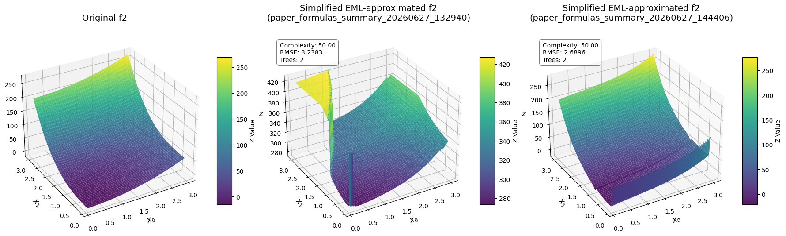
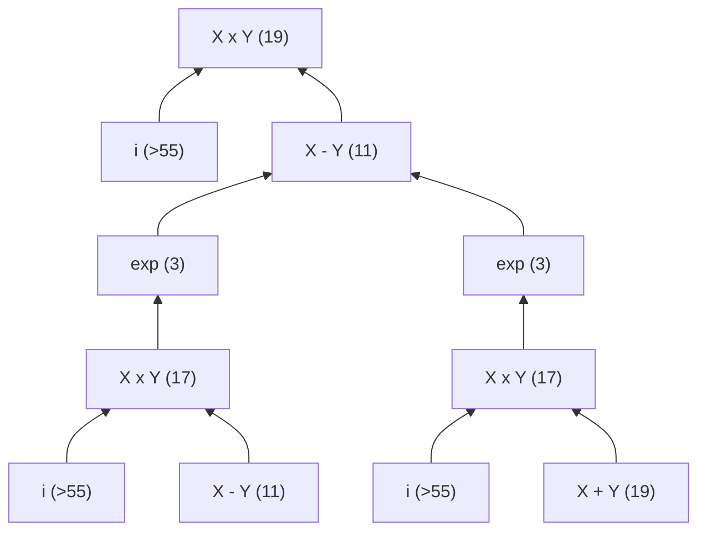
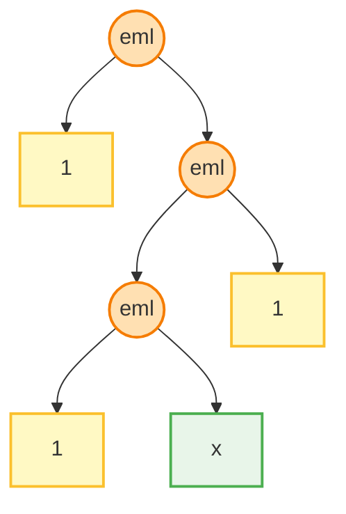

# Project report: Bayesian Symbolic Regression on EML-trees

# A Bit of Theory
## Project Context and Objectives
This project is based on two primary papers:

`"Bayesian Symbolic Regression"` (Jin et al., 2020)

`"All elementary functions from a single operator"` (Odrzywołek, 2026)

The goal of the project is to research the influence of reducing the mathematical operation set down to a single binary operator (EML) and unity (the constant 1) within the Bayesian Symbolic Regression framework.

## Foundations of Symbolic Regression

### Symbolic Regression (SR)
Symbolic regression is a type of regression analysis that searches the space of mathematical expressions constructed using a predefined set of operators to find the model that best fits a given dataset, balancing both accuracy and simplicity.

- **No pre-specified model structure** is provided as a starting point. Expressions are formed by combining basic mathematical building blocks (operators, constants).

-  **Expressions are represented as syntax trees**. While standard operator sets yield mixed binary/unary branches, the EML set produces strictly proper binary trees.

- **The following operators sets were considered**
  - Original (reduced) set - `paper`: 
```math
\Omega_{paper} = \{+,\ \times,\ \exp(x),\ inv(x):=1/x,\ neg(x):=-x,\ lt_{a,b}(x):=ax+b\}
```

    _Note: in the repo linear transformation is referred to as_ `ln`
  - `default` (extended) in the original repo: 
```math
\Omega_{default} := \Omega_{paper} \cup \{\sin, \cos, x^2, x^3 \}
```

  - EML set - `exp_log`: 
```math
\Omega_{EML} = \{1,\ eml(x,y):=\exp(x)-\ln(y)\}
```


### Theoretical Comparison: BSR vs. Kolmogorov-Arnold
- **Bayesian SR** constructs signals via linear combinations of symbolic trees governed by complexity priors:
```math
y = \beta_0 + \sum_{i=1}^{k} \beta_i \cdot g(x; T_i, M_i, \Theta_i) + \epsilon, \quad \epsilon \sim N(0, \sigma^2)
```

- **Kolmogorov-Arnold Theorem** decomposes multivariate continuous functions $f: [0,1]^n \to \mathbb{R}$ into nested finite sums of continuous unary functions:
```math
f(x_1, \dots, x_n) = \sum_{q=0}^{2n} \Phi_q \left( \sum_{p=1}^n \phi_{q,p}(x_p) \right)
```


Both architectures treat outer addition ($+$) as a fundamental metaoperation on fitted subfunctions. However, BSR targets interpretable, discrete algebraic equations rather than continuous black-box layers.

## Bayesian Symbolic Regression (BSR) Mechanics
### Component Priors
- To govern structural complexity and protect human interpretability, BSR uses explicit **prior distributions on tree structures** ($T$) to penalize overly deep or complex expressions.
- Internal operator **nodes are chosen based on pre-allocated probability weights**. 
- Terminal leaf nodes map to feature indices $M$ randomly drawn via a uniform weight distribution across all feature dimensions.

### Parametrization and Structural Assembly
- **Linear Transformation Nodes ($lt$)**: 
  Specific to `default` and `paper` operastors set, this internal node scaling uses parameters $\Theta = (a, b)$ representing $ax+b$. This smooths optimization trajectories. The prior for these parameters is a Gaussian distribution centered around the identity function ($a=1, b=0$).
- The overall response variable $y$ **aggregates** $k$ independent symbolic trees via an Ordinary Least Squares (OLS) fitting pipeline:
```math
y = \text{OLS}\left(x, \{(T_i, M_i, \Theta_i)\}_{i=1}^{k}\right) + \epsilon, \quad \epsilon \sim N(0, \sigma^2)
```

- Global linear tree **weights** ($\beta_i$) are solved directly using OLS optimization based on the outputs generated by the $k$ component architectures.
- In the experiments, $k:=3$. BSR proves to be robust to changes in this hyperparameter.

### Markov Chain Monte Carlo (MCMC) Sampling

- **Metropolis-Hastings Sampling -** structural exploration iteratively samples modified tree topologies from a proposal distribution, accepting or rejecting structural changes sequentially
- Because structural modifications (adding or removing operator nodes) dynamically shift the dimensionality of the parameter space $\Theta$, standard MH steps fail. The framework applies **Reversible Jump MCMC (RJMCMC)** to compute exact acceptance rates $R$ across varying dimensions.
- The global **noise scale parameter $\sigma^2$ is updated continuously** by sampling directly from a conjugate Inverse Gamma prior.

## EML Basis
### Minimal Set of Operations

The EML operator provides a functional framework capable of representing every elementary mathematical function.
- The Core EML Operator is a simple, asymmetric binary operator:
```math
\text{eml}(x, y) = \exp(x) - \ln(y)
```

- Total functional completeness requires only one binary operator ($\text{EML}$) and a single terminal symbol (the constant $1$).

### Complex plane
- Tree structures using the restricted set $\{\text{EML}, 1\}$ must navigate through complex arithmetic as intermediate representations within internal nodes to reconstruct fundamental constants and periodic functions.
- By introducing the complex domain, negative arguments can cross into the imaginary plane ($\ln(-1) = i\pi$). This allows standard trigonometric and hyperbolic operations to be fully synthesized as complex exponential layouts via Euler's formulas:
```math
\cos(x) = \frac{1}{2}\left[\exp(ix) + \exp(-ix)\right]
```
```math
\sin(x) = -\frac{i}{2} \left[\exp(ix) - \exp(-ix)\right]
```


# Experiments

## Installation & Running Instructions

### Prerequisites & Installation
To run the Bayesian Symbolic Regression (BSR) framework and the EML experiments, firstly install the package in editable mode so that the `bsr` module is globally accessible to the benchmark scripts:
```bash
cd MCMC-SymReg
pip install -e .
```

### Running the Experiments
The main entry point for running the benchmark formulas is `experiments/run_paper_formulas.py`.
The most useful arguments for this script are:
- `--formulas`: Specify the subset of formulas to test (e.g. `f1` to `f6`, or `f_eml_test1` to `f_eml_test4`).
- `--operation-sets`: Specify which set of operations to use (`default`, `paper`, `exp_log`).
- `--iterations`: Number of MCMC iterations (e.g., `96` or `200` for complex EML searches).
- `--proposals`: Number of proposals per step (defaults to `2000` to allow sufficient exploration).
- `--n-jobs`: Number of parallel chains/CPU threads to run (e.g., `32`).

**Example Run:**
```bash
python experiments/run_paper_formulas.py --formulas f1 f2 f_eml_test1 --operation-sets exp_log --iterations 96 --n-jobs 32 --proposals 2000
```
## Benchmark Targets


The following 6 formulas were used as a benchmark in the original **BSR paper**:
- $ f_1 := 2.5 x_0 ^4 - 1.3  x_0^3 + 0.5  x_1^2 - 1.7  x_1$
- $ f_2 := 8 x_0 ^ 2 + 8 x_1 ^ 3 - 15 $
- $ f_3 := 0.2 x_0 ^ 3 + 0.5 x_1 ^ 3 - 1.2 x_1 - 0.5 x_0 $
- $ f_4:= 1.5 \exp(x_0) + 5 \cos(x_1) $
- $ f_5:= 6  \sin(x_0)  \cos(x_1) $
- $ f_6:= 1.35 x_0 x_1 + 5.5 \sin((x_0- 1.0) \cdot (x_1 - 1.0)) $
  
Evaluation: dataset consists of uniformly generated 100 sample data points across the domain range $x_0,x_1 \in [0.1, 5.9]$.

## Final Results Summary
The final results comparing the three operation sets across all benchmark formulas and EML-specific test formulas during one consolidated run are summarized below.

*Detailed results can be found in the folder `./experiments/results/final/` specifically `final_run.csv` and `final_run.txt`.*

#### Benchmark Formulas ($f_1$ to $f_6$)
Numbers in the cells represent RMSE (Train/Test) and **Complexity**.
| Formula | `default` | `paper` | `exp_log` (EML) set |
|---|---|---|---|
| **$f_1$** | $0.01662$ / $0.01751$ <br> **17** | $0.09895$ / $0.10582$ <br> **48** | $62.58167$ / $80.48665$ <br> **127** |
| **$f_2$** |  $3.1 \times 10^{-5}$ / $3.3 \times 10^{-5}$ <br> **8** | $5.5 \times 10^{-5}$ / $5.2 \times 10^{-5}$ <br> **15** | $51.14151$ / $55.53686$ <br> **97** |
| **$f_3$** | $9.6 \times 10^{-6}$ / $1.0 \times 10^{-5}$ <br> **23** | $0.04315$ / $0.04497$ <br> **30** | $2.87591$ / $3.32785$ <br> **179** |
| **$f_4$** |  $1.0 \times 10^{-5}$ / $1.0 \times 10^{-5}$ <br> **10** | $0.16902$ / $0.27851$ <br> **39** | $1.46171$ / $1.54410$ <br> **249** |
| **$f_5$** |  $1.1 \times 10^{-7}$ / $1.0 \times 10^{-7}$ <br> **12** | $2.77454$ / $2.85032$ <br> **17** | $2.60806$ / $2.80786$ <br> **599** |
| **$f_6$** | $3.48422$ / $3.70906$ <br> **13** | $3.20180$ / $3.63576$ <br> **14** | $7.21936$ / $7.36068$ <br> **509** |

#### EML Test Formulas ($f_{\text{eml\\_test1}}$ to $f_{\text{eml\\_test4}}$)

| Formula | Target| `paper` set | `exp_log` (EML) set |
|---|---|---|---|
| **$f_{\text{eml\\_test1}}$** | $x_0^2 $| $9.8 \times 10^{-7}$ / $1.1 \times 10^{-6}$ <br> **12** | $0.99891$ / $1.21311$ <br> **19** |
| **$f_{\text{eml\\_test2}}$** |$x_0^3 $ | $6.9 \times 10^{-6}$ / $6.6 \times 10^{-6}$ <br> **10** | $13.46164$ / $14.28857$ <br> **25** |
| **$f_{\text{eml\\_test3}}$** |  $x_0^2 + x_1^2 + x_0 x_1$ | $2.6 \times 10^{-6}$ / $2.9 \times 10^{-6}$ <br> **14** | $6.38797$ / $6.47829$ <br> **37** |
| **$f_{\text{eml\\_test4}}$** |  $\cos(x_0) + \sin(x_1)$ | $0.14030$ / $0.17403$ <br> **46** | $0.61475$ / $0.62960$ <br> **150** | 
The plot below shows a comparative view of the accuracy _Test RMSE_ on a log scale and _model complexity_ on a linear scale across all 10 benchmark formulas:


### EML Benchmark on Reduced Interval [0.1, 3.0] with Multi-Tree Configurations

To address EML's extreme numerical sensitivity and representation complexity, a secondary benchmark suite was executed on a reduced interval $[0.1, 3.0]$ (both for training and testing). 

#### Objectives of the Reduced Domain and Multi-Tree Setup
1. **Preventing Overflow/Clipping:** Under $[0.1, 5.9]$, nested exponentials immediately hit BSR's internal $10^{12}$ clipping ceiling. Reducing the domain to $3.0$ lowers the raw values (since exponents are less prone to explode), preventing the MCMC sampler from getting stuck in clipped, gradient-less regions.
2. **Increasing Additive Capacity (Multi-Tree Configurations):** BSR was configured to use up to 4 trees for $f_1, f_3, f_4, f_5, f_6, f_{\text{eml\\_test4}}$, 2 trees for $f_2, f_{\text{cos}}$, and 1 tree for $f_{\text{xy}}, f_{\text{eml\\_test1}}, f_{\text{eml\\_test2}}$ (based on optimal estimated additive structures).
3. **Optimized Hyperparameters:** The experiments were run with a search budget of 500 proposals per step and 96 iterations, using customized initial simulated annealing temperatures ($T_{\text{start}} \in [50.0, 300.0]$) to maximize exploration.
4. **Trigonometric and Product Benchmarks:** Added $f_{\text{cos}} := \cos(x_0)$ and $f_{\text{xy}} := x_0 \cdot x_1$ to benchmark EML's core representation capabilities on transcendental and multiplicative primitives.

#### Results on the Reduced Interval $[0.1, 3.0]$
The best results obtained across the runs (`20260627_132940` and `20260627_144406`) are summarized below:

| Formula | Target | Max Trees | Active Trees | Complexity | Train RMSE | Test RMSE | Key Finding / Active Expression |
|---|---|---|---|---|---|---|---|
| **$f_1$** | $2.5 x_0^4 - 1.3 x_0^3 + 0.5 x_1^2 - 1.7 x_1$ | 4 | 2 | 90 | 0.6137 | 0.5046 | **Collapsed to 2 active trees**; 2 trees died. |
| **$f_2$** | $8 x_0^2 + 8 x_1^3 - 15$ | 2 | 2 | 50 | 2.7773 | 2.6896 | Fits both polynomial terms smoothly. |
| **$f_3$** | $0.2 x_0^3 + 0.5 x_1^3 - 1.2 x_1 - 0.5 x_0$ | 4 | 3 | 74 | 0.1253 | 0.1563 | **Collapsed to 3 active trees**; 1 tree died. |
| **$f_4$** | $1.5 e^{x_0} + 5 \cos(x_1)$ | 4 | 3 | 170 | 0.2437 | 0.2684 | Fits the exponential and cosine terms cleanly. |
| **$f_5$** | $6 \sin(x_0) \cos(x_1)$ | 4 | 2 | 500 | 1.2299 | 1.2676 | **Collapsed to 2 active trees**; 2 trees died. |
| **$f_6$** | $1.35 x_0 x_1 + 5.5 \sin((x_0-1)(x_1-1))$ | 4 | 2 | 190 | 2.0821 | 2.0951 | **Collapsed to 2 active trees**; 2 trees died. |
| **$f_{\text{xy}}$** | $x_0 x_1$ | 1 | 1 | 19 | 0.4142 | 0.4322 | Fits as a single multiplicative EML tree. |
| **$f_{\text{cos}}$** | $\cos(x_0)$ | 2 | 1 | 160 | 0.2286 | 0.2451 | **Collapsed to 1 active tree**; 1 tree died. |
| **$f_{\text{eml\\_test1}}$** | $x_0^2$ | 1 | 1 | 19 | 0.1458 | 0.1519 | Stable quadratic approximation. |
| **$f_{\text{eml\\_test2}}$** | $x_0^3$ | 1 | 1 | 29 | 0.1877 | 0.1870 | Stable cubic approximation. |
| **$f_{\text{eml\\_test3}}$** | $x_0^2 + x_1^2 + x_0 x_1$ | 3 | 3 | 69 | 0.6966 | 0.7425 | Full 3-tree additive fit. |
| **$f_{\text{eml\\_test4}}$** | $\cos(x_0) + \sin(x_1)$ | 4 | 3 | 150 | 0.1564 | 0.2188 | **Collapsed to 3 active trees**; 1 tree died. |

#### Phenomenon of "Tree Death" and Surface Shifts (OLS Discarding)
Even when BSR was given a budget of 3 (default) or 4 trees, the stochastic MCMC sampler was unable to coordinate them into a unified fit. Instead, one or more trees always "died" (bloated into a highly complex, random shape that OLS eventually zeroed out by assigning a coefficient $<10^{-12}$). This shows that merely increasing the tree count does not help BSR solve EML's combinatorial limits; rather, BSR naturally reverts to a lower-capacity model of 1 or 2 active trees.

* **Divergent Surface Shifts (Detached Surfaces):** In the OLS fitting process, all tree weights ($\beta_i$) and the global intercept ($\beta_0$) are solved jointly. If a bloated tree $T_i(x)$ evaluates to an extremely large value (such as $10^{12}$ due to clipping), OLS fits a tiny coefficient $\beta_i \approx 10^{-12}$ to scale it back down. However, the product $\beta_i \cdot T_i(x) \approx 1.0$ acts as a constant offset across the domain, which OLS compensates for by shifting the global intercept $\beta_0$ or other tree coefficients. If one later **removes/discards** these bloated trees (due to their tiny coefficients), the balanced offset can be broken. The remaining active expression is left with the unadjusted intercept $\beta_0$, causing the approximated surface to appear "detached" (shifted vertically) from the original surface in the 3D plots. Figure below (in the center) demonstrates such a shift.
  

Detailed 3D surface comparisons and convergence curves for these runs are documented in the Jupyter notebook: [Visualisations_EML_on_reduced_interval,_up_to_4_trees.ipynb](./experiments/Visualisations_EML_on_reduced_interval,_up_to_4_trees.ipynb)

#### Intermediate Conclusions:
1. **Domain Reduction & Hyperparameter Tuning are Paramount:**
   Reducing the evaluation range from $[0.1, 5.9]$ to $[0.1, 3.0]$ combined with highly optimized hyperparameters (such as simulated annealing and fine-tuned tree priors) yielded a massive improvement. Comparing these results to the initial consolidated run on the $[0.1, 5.9]$ interval shows that BSR can achieve excellent approximations once the exponential terms are prevented from blowing up.
2. **Impact of the Number of Trees is Negligible:**
   Increasing the allowed number of trees from 3 to 4 does not automatically translate to a better fit or different mathematical behavior:
   * **Stochastic Coordination Failure:** Because BSR's MCMC steps mutate only one tree at a time, there is no joint optimization mechanism to coordinate multiple trees. If the target requires cooperative multi-tree structures, BSR struggles to build them.
   * **Tree Death and Bloat:** Consequently, the extra tree capacity is often wasted. The algorithm bloats the extra trees into high-complexity configurations that OLS ultimately discards by setting their coefficients to zero (or near $10^{-12}$).
   * **Exception in Separable Functions:** The number of trees only matters if the underlying formula is naturally decomposed into additive terms that match the tree count (e.g. $f_1$, where a 4th-degree polynomial is nicely split across active trees, or $f_2$ which is represented cleanly by exactly 2 trees). Beyond this natural additive partition, BSR simply collapses back to a smaller number of active trees. However, not always does BSR make use of all the trees. For instance, approximating $f_1$ required only 2 active trees.


## Theoretical Digression: Optimization Landscapes, Local Minima, and Hyperparameter Tuning on EML Trees

### Functional Reconstruction and Structural Complexity Estimates under EML basis
To understand how complex expressions are synthesized under the EML operation set, consider $ f_5:= 6  \sin(x_0)  \cos(x_1) $.
In the **EML paper** the author shows that the following "buildig blocks" will have the indicated complexity (number of nodes in the tree):
| Formula | Complexity [direct search]| 
|-------|------| 
|$1$ | 1
|$0$|7
|$2$|19 (derived from $x+y$)
|$-1$| 17 (15 in extended reals)
|$i$|>55
|$x$|9
|$-x$|15
|$x^2$|17  (derived from $x\cdot y$)
|$\exp(x)$|3
|$\ln(x)$|9
|$x+y$| 19|
|$x-y$|11|
|$x\cdot y$|17
|$(x+y)/2$|>27
|$x^2+y^2$|>27

One can manually reconstruct the formula for $f_5$ (there are few ways, only one is given) as follows:

$ f_5 = 6 \sin(x) \cos(y) =  6 \frac{e^{ix} - e^{-ix}}{2i} \frac{e^{iy} + e^{-iy}}{2} = -\frac{6}{4} i \cdot (e^{ix} - e^{-ix})(e^{iy} + e^{-iy}) = -1.5 i (e^{i(x+y)} + e^{i(x-y)} - e^{i(y-x)} - e^{-i(x+y)})  = -1.5 (i [e^{i(x+y)} - e^{-i(x+y)}] + i[e^{i(x-y)} - e^{i(y-x)}] ) $ 
which represents the sum of 2 EML-trees with coefficients -1.5. Having 3 trees would preserve one of the trees fully, while splitting another into 2 subtrees. In case of 4 trees each tree will represent a complex exponent.

Constructing the tree from the given building blocks yields the following structure (the second tree will look the same except for the reverted leaf "X + Y" and "X - Y" order at the bottom). 
_Numbers in the brackets indicate complexity of an expression (number of nodes in the corresponding tree)._


The overall complexity of this tree is $c > 19 -1 + 55 -1+11 + (-1+3 -1+17 -1+55 -1+11) + (-1+3 -1+17 -1+55 -1+19)= 255$

Given estimated complexity of a tree, its depth (counting nodes) can be heuristically approximated with the expected depth of a tree uniformly generated across all the possible topologies of binary trees: $ d \approx \sqrt{2\pi c} > 40$.

Summary of the derived values for all the formulas $f_i$ is provided below. These estimates are obtained by heuristically constructing trees as demonstrated above and does not reflect optimal complexity of each EML-tree, but rather demonstrates how complex and deep EML-trees can be. 
_Note: all the experiments assume that number of trees is 3, however in many cases 2 trees can be split into 3 trees, thus reducing indicated complexity._


| Formula's index, $i$ | Complexity, $c_i$ | Depth estimate, $d_i$|Notes
|-|----------| ---|--------------|
|1|$ 92 (86), 127$ or, in case of 4 trees, $33, 25, 17, 9$|$24,28.2$, or exactly $17, 13, 9, 5$|Approximation error of estimated nested coefficients: $0.02-0.066$ (2 trees).
|**2***|$17, 25$|Exactly $9, 13$| ***The easiest problem**. Coefficients 8, 8 and -15 are fitted during OLS fitting phase. Essentially one only needs to construct one tree for $x_0^2$ and another one for $x_1^3$
|3|$113 (107), 95$ or, in case of 4 trees, $25, 25, 9,9$|$26.6, 24.4$, or exactly $13,5$|Approximation error $\approx 0.05 $ (2 trees)
|4|$3,197 (195)+ $ or $3, 73+, 87+$|$2, 35.2$, or $2, 21.4, 23.5$|The main difficulty is finding a tree for $\cos(x_1)$ function. In case of 3 trees, the first tree searches for exp, the other two reconstruct $e^{iy}+ e^{-iy} \rarr e^{iy}$ and $e^{-iy}$ - the problem should be easily solved with 3 trees.
|**5****|$255$|$40$|Identical for both trees, i.e. total complexity is around 2^9. ****The most difficult problem.** In case of 3 trees, one tree fully approximates one half of the expression with the same complexity, and 2 other trees split the other half.
|6|$17, 175+$ or $17, 73+, 87+$|as above|Similarly to $f_4$, $\cos$ can be easily split into 2 exponents.|

### The Complexity of Discovering Euler's Formula
While the restricted set $\{\text{EML}, 1\}$ is theoretically functionally complete over the complex plane, discovering exact identities via stochastic search is limited by a **combinatorial wall**. For a tree layout of complexity $c > 255$ (containing 127 internal nodes), the topology search space contains at least $10^{73}$ unique configurations ($127$-th Catalan number).

**To traverse this space, the MCMC sampler must cross a deep fitness valley.** It should build and maintain deep intermediate trees (e.g., building $-1$ or $i$) which temporarily offer no improvement in RMSE, until the full mathematical identity merges. Without specialized hyperparameter adjustments, the sampler rejects these intermediate moves and falls back to standard low-order Taylor series or rational approximations.

#### Experiments with Extended Cyclic Simulated Annealing
To test this limitation, a cyclic simulated annealing experiment was executed targeting $f_5$ using a 600-node complexity ceiling, a maximum depth boundary of 45, and 2000 proposals per MCMC step over 200 iterations across 32 computing cores (representing 5.5+ hours of computational time):

* **Train RMSE**: $2.52555$
* **Test RMSE**: $2.80375$
* **Tree Complexity**: $599$ nodes (virtually hitting the $600$ complexity limit)
* **OLS Coefficients**: $[0.95598,\ -2.08833 \times 10^{-12},\ -9.00937 \times 10^{-13},\ -3.29704 \times 10^{-12}]$

_Note: Results can be found here `./experiments/results/final/eml_f5_best_results.txt, .csv`_**

The final extracted expression is:
```math
f(\mathbf{x}) \approx 0.95598 - 2.08833 \cdot 10^{-12} \cdot \text{Tree}_1 - 9.00937 \cdot 10^{-13} \cdot \text{Tree}_2 - 3.29704 \cdot 10^{-12} \cdot \text{Tree}_3
```

Because the OLS regression step assigned coefficients on the order of $10^{-12}$ to the three deep EML subtrees, they are effectively zeroed out. The model mathematically behaves as a simple **constant model**:
```math
f(\mathbf{x}) \approx 0.95598
```

This test confirms the combinatorial explosion hypothesis. The MCMC sampler merely bloated the trees to $599$ nodes in a chaotic search, producing non-functional, oversized expressions that OLS had to discard, proving BSR is practically unable to discover periodic functions under stochastically-guided symbolic regression.

Based on these values, one can try to tune hyperparameters to achieve better results for EML-based BSR.
_Note: In the BSR repo, complexity of a model is defined as a sum of complexities of underlying trees_

### Hyperparameter Tuning Strategies for Improving Complexity and Fitting
To allow the MCMC sampler to find and maintain these complex structures, several parameters in the code (`MCMC-SymReg/codes/funcs.py`) can be adjusted:

1. **Flatten the tree prior ($\beta$)** in probability of splitting a node at depth $d$ is: 
```math
\text{p} = \frac{1}{(1 + d)^{-\beta}}
```


    When $\beta = -1.0$ or $\beta = -0.5$, this probability decays very quickly. The prior probability of a large tree (e.g., depth 8, complexity 100) is computationally zero, causing the MCMC sampler to immediately reject large proposals.
    Thus, $\beta$ should be chosen closer to zero (e.g., $\beta = -0.1$ or $\beta = -0.05$) to flatten the depth penalty and allow complex trees (while max depth limit should be imposed (e.g. <40) to avoid infinite expansion)
2. Adjust the **Growth Proposal Bias** ($p_{\text{grow}}$)
    The MCMC proposal probability for growing a node is: 
```math
p_{\text{grow}} = (1 - p_{\text{stay}}) \cdot \frac{\min(1, 4 / (N_{\text{internal}} + 2))}{3}
```


    As the tree gets larger (e.g., $N_{\text{internal}} \ge 50$), $p_{\text{grow}}$ becomes extremely small, while pruning actions become much more common.
    Adjusting the proposal probability calculation ensures that growth proposals remain active and resilient
3. **Simulated Annealing Tempering:** Scaling the core log-likelihood calculations by an adjustable temperature factor ($1/T$) during early execution phases permits the Markov chain to explore large, temporary high-error structures without triggering immediate rejection, thus passing a massive "fitness valley" of flat, high-error likelihood.
4. **Numerical Clipping, OLS Suppression, and Raw Evaluation Divergence**
    * **Numerical Clipping in Training:** Because the EML operation set contains recursively nested exponentials, outputs can easily overflow standard float representations. The BSR code (`MCMC-SymReg/codes/funcs.py`) prevents this by clipping the inputs of exponential nodes to `SAFE_LOG_VALUE` ($\approx 27.63$), meaning internal tree evaluations are capped at `SAFE_VALUE` ($1e12$). 
    * **OLS Suppression of Exploded Trees:** During MCMC fitting, the sampler often grows trees that trigger this clipping threshold across parts of the domain. The Ordinary Least Squares (OLS) step fits the coefficient vector $\beta$, assigning these "exploded" trees extremely tiny coefficients (e.g., $\beta_i \approx 10^{-13}$) so that their contribution on training/testing data is suppressed ($\beta_i \cdot T(x) \approx 10^{-13} \cdot 10^{12} = 0.1$). This enables the overall model to achieve very low training and testing RMSE.
    * **Divergence in Raw String Evaluation:** If a plotting script or external evaluator processes the final symbolic string directly (without implementing BSR's internal $10^{12}$ clipping boundary), the nested exponentials immediately overflow to $+\infty$. This makes outer logarithms evaluate to $\ln(\infty) = \infty$. Even when multiplied by a tiny OLS coefficient like $10^{-13}$, the product remains infinite ($\infty$). Depending on the sign, the entire evaluated surface collapses to $-\infty$ (clipped to the Z-axis minimum of $-1000$ in $f_4$) or explodes to a huge positive scale (like $1.75 \times 10^7$ in $f_5$).
    * **The Solution (Filtering Unstable Trees):** To resolve this divergence, trees with tiny coefficients (e.g., $|c| < 1e-6$) must be discarded from the final expression. Because their contribution was only stable under clipping, discarding them does not impact the model's true predictive performance but removes the unstable/exploding terms, restoring the correct underlying surface. However, this does not guarantee correct plotting since discarded terms could contribute to the vertical offset.

## EML Representations and MCMC Local Minima Analysis

I performed a deep-dive analysis into the EML (`exp_log`) representation properties and why the MCMC sampler struggles to find the expected trees for benchmark formulas like $f_2 := 8 x_0^2 + 8 x_1^3 - 15$.

### Theoretical Complexity and General Formula
Using an optimized dynamic programming search script based on numerical evaluation hashing (observational equivalence), a general formula for representing monomial terms $x^n$ under the EML operation set was derived as follows.
Given the following expression of complexity 7
```math
\ln(x) \equiv \text{eml}(1, \text{eml}(\text{eml}(1, x), 1))
``` 

and by recursively constructing the term $e - \ln(x^n) = e - n\ln(x)$ through nesting, one obtains:
1. $\text{eml}(1, x) = e - \ln x$ (complexity 3, depth 2)
2. $\text{eml}(\ln(e - \ln x), x) = e - \ln(x^2)$ (complexity 11, depth 6)
3. $\text{eml}(\ln(e - \ln(x^2)), x) = e - \ln(x^3)$ (complexity 19, depth 10)
4. $\text{eml}(\ln(e - \ln(x^{n-1})), x) = e - \ln(x^n)$ (complexity $8n - 5$, depth $4n - 2$)

To retrieve $x^n$ from $e - \ln(x^n)$, one should add the standard 3 final steps:
* $\text{eml}(e - \ln(x^n), 1) = e^e / x^n$ (+2 complexity, +1 depth)
* $\text{eml}(1, e^e / x^n) = \ln(x^n)$ (+2 complexity, +1 depth)
* $\text{eml}(\ln(x^n), 1) = x^n$ (+2 complexity, +1 depth)

This yields the general closed-form formula for $x^n$ under EML:
* **Complexity**: $C(x^n) = 8n + 1$
* **Depth**: $D(x^n) = 4n + 1$ (1-indexed depth counting nodes)

For the benchmark monomials:
* **$0$** has a complexity of **7** nodes and depth **5**:
  `eml(1, eml(eml(1, 1), 1))`
* **$x$** has a complexity of **9** nodes and depth **5**:
  `eml(eml(1, eml(eml(1, x), 1)), 1)`
* **$x^2$** has a complexity of **17** nodes and depth **9**:
  `eml(eml(1, eml(eml(eml(1, eml(eml(1, eml(1, x)), 1)), x), 1)), 1)`
* **$x^3$** has a complexity of **25** nodes and depth **13**:
  `eml(eml(1, eml(eml(eml(1, eml(eml(1, eml(eml(1, eml(eml(1, eml(1, x)), 1)), x), 1)), x), 1)), 1))`
* **$x^4$** has a complexity of **33** nodes and depth **17**.

### Why MCMC gets stuck in local minima (Complexity 7 on $f_2$ with beta=-1)?
* Transitioning from a single terminal node ($x$, depth 5, complexity 9) to $x^3$ (depth 13, complexity 25) requires a sequence of 16 consecutive growth steps.
* The intermediate trees of complexity 11, 13, 15, etc., generated along the way do not correlate with $x^3$ or $x^2$ and provide no intermediate RMSE improvement.
* Since OLS cannot fit these intermediate functions to the target function better than a simple variable tree, the likelihood remains low, and MCMC rejects these transitions with probability 1.
* The sampler is trapped in a deep "fitness valley" at complexity 7 (using simple variables $x_0$ and $x_1$), unable to cross the steps to form $x^3$ or $x^2$.

### MCMC Sampler Entrapment
When running purely stochastic MCMC (without tempering/annealing), even relaxing the prior complexity penalty (using a weaker prior $\beta = -0.5$) and significantly increasing the search budget to `proposals = 2000` left the sampler trapped in low-complexity trees:
* **$f_1$ (EML)**: Complexity stopped at **23** (Train RMSE: `25.9959`).
* **$f_2$ (EML)**: Complexity stopped at **21** (Train RMSE: `45.0826`).

Since the exact polynomial representations have high minimum complexities ($x^2$: 17 nodes, $x^3$: 25 nodes, $x^4$: 33 nodes), any small MCMC step that grows a node in a random direction almost certainly degrades the numeric fit, blocking growth. 

Introducing Simulated Annealing to force the chain out of these local minima (with $\beta = -0.5$ and $T_{start} = 200$) helped the sampler to successfully grew massive trees, but still failed to find the exact polynomial structure. Instead, the trees bloated into chaotic configurations:
* **$f_1$ (EML with SA)**: Bloated to Complexity **127** with high Train RMSE: `62.58`
* **$f_2$ (EML with SA)**: Bloated to Complexity **97** with high Train RMSE: `51.14`

This confirms that simply allowing the tree to grow large via weaker priors or high temperatures does not help BSR find the specific deep, nested structures required by EML; it merely leads to unsearchable, high-error tree bloat.


### Deeply Restricted Depth and Loose Prior ($\beta = -0.1$, $\text{max\_depth} = 18$)
To test if the sampler could navigate the search space when focused only on the depth-restricted subspace where the exact EML representations ($x^2$ depth 9, $x^3$ depth 17) reside, I ran experiments with `max_depth = 18` and a very loose prior `beta = -0.1` (which imposes virtually no penalty on growing):
* **$f_1$ (EML)**: Bloated to a complexity of **235** (Train RMSE: `35.0919`, which is worse than the constrained run!). The sampler got lost in the massive, chaotic search space of deep trees where random changes have unpredictable effects, resulting in a large, meaningless tree with poor coefficients.
* **$f_2$ (EML)**: Collapsed to a complexity of **5** (Train RMSE: `48.0886`), representing only the simplest terms $3.87 e^{x_1} + 49.4 x_0 + 92.2 x_1 - 167.9$. Because all proposed intermediate large trees fit the data poorly, the sampler preferred the simplest linear/exponential terms.

To check if giving the sampler a small depth "headroom" (wiggle room to transition between states) while strictly capping complexity to prevent chaotic bloating could help, I also tested:
* **`f1`** with `max_depth = 19` and `max_complexity = 110`: Stopped at complexity **11** (Train RMSE: `40.3751`).
* **`f2`** with `max_depth = 15` and `max_complexity = 60`: Stopped at complexity **53** (Train RMSE: `45.8845`).

Even with headroom, the sampler was unable to discover the exact polynomial terms (such as $x_1^3$ at depth 13). Instead, it either collapsed to a simpler linear model (complexity 11) or grew a complex 51-node tree (`tree_1`) that mathematically simplifies to a noisy representation of $e^{x_1}$ without any actual fit improvement.

This confirms that the MCMC symbolic regression sampler on EML trees is fundamentally limited when representing polynomials, as the likelihood landscape remains a rugged "fitness valley" that cannot be navigated via local MCMC proposals.


### Results of Simulated Annealing and Parameter Tuning on $f_1$ and $f_2$ under EML
_Note: Results for Simulated Annealing experiments can be found here: `\experiments\results\final\eml_f12_SA.txt`_
To address the MCMC sampler entrapment under the EML operation set, I tried to use simulated annealing (MCMC tempering) with configurable starting temperature $T_{\text{start}}$ and cooling schedule $cool\_fraction$. Various parameter configurations were evaluated on $f_1$ and $f_2$ over 96 independent MCMC chains (`iterations = 96`) run in parallel:

| Formula | Configuration | Max Complexity / Depth | Train RMSE | Test RMSE | Tree Complexity | Description / Outcome |
|---------|---------------|------------------------|------------|-----------|-----------------|----------------------|
| $f_1$ | Default (no SA) | 250 / 35 | 25.9959 | - | 23 | Stuck in a low-complexity local minimum. |
| $f_1$ | $T_{\text{start}}=200$, $cool\_fraction=0.8$ | 250 / 35 | **10.7978** | 12.4406 | 103 | **Significant improvement.** Higher initial temperature allowed the sampler to cross fitness valleys and find a much better approximating tree. |
| $f_2$ | Default (no SA) | 150 / 30 | 45.0826 | - | 21 | Stuck in simple linear/exponential local minimum. |
| $f_2$ | $T_{\text{start}}=200$, $cool\_fraction=0.8$ | 150 / 30 | **37.5415** | 47.5014 | 61 | **Best fit found.** High temperature allowed building a larger approximating tree. |
| $f_2$ | $T_{\text{start}}=200$, $cool\_fraction=0.8$ (Tighter Bounds) | **60 / 20** | 45.2459 | 43.4396 | 35 | Restricting parameters to close to exact limits ($x^3$ depth 13, complexity 25) prevents BSR from building larger approximating trees, and due to MCMC entrapment, it still cannot find the exact clean monomial structures. |
| $f_2$ | $T_{\text{start}}=1000$, $cool\_fraction=0.9$ (Tighter Bounds) | **60 / 20** | 57.5535 | 56.3073 | 57 | Excessive temperature ($T_{\text{start}}=1000$) combined with a fast cooling schedule acts as a quench, trapping the chains in highly random, disordered states with very high error. |
| $f_2$ | $T_{\text{start}}=300$, $cool\_fraction=0.8$ (Moderate Bounds) | **100 / 25** | 46.1640 | 45.4987 | 45 | Moderate bounds still constrain the sampler's ability to approximate polynomials, yielding intermediate results. |

### Summary and Conclusions for EML Fitting
1. **Simulated Annealing is highly effective at boosting exploration:** For $f_1$, enabling simulated annealing with $T_{\text{start}} = 200.0$ halved the train RMSE from $25.99$ to $10.79$. For $f_2$, it achieved the lowest RMSE of $37.54$.
2. **Capping complexity too tightly degrades performance:** The experiment of reducing $f_2$'s bounds to `max_complexity = 60` and `max_depth = 20` showed that because the sampler cannot find the exact, clean polynomial trees (due to local proposal MCMC entrapment), it relies on building larger approximating structures. Preventing the sampler from building these structures (by setting tight bounds) forces it to settle for even worse fits (RMSE $\approx 45.2$).
3. **High temperature schedules require careful tuning:** Setting a very high temperature like $T_{\text{start}} = 1000.0$ with a long cooling fraction of $0.9$ causes the sampler to accept almost any proposal for $90\%$ of the run, resulting in a sudden quench during the final $10\%$. This traps the chains in highly disordered states (RMSE $57.55$). A moderate temperature ($T_{\text{start}} = 200.0 \text{ to } 300.0$) and standard cooling fraction ($0.8$) is optimal.

### Focused Hyperparameter Tuning on EML Target $x_0^2$ (Quadratic Monomial)

To evaluate if BSR can find the exact representation of $x_0^2$ (minimal EML complexity of 17) under optimal configurations, I conducted two hyperparameter experiments:

#### Experiment A: Constrained depth (`max_depth = 12`, `max_complexity = 25`)
The following hyperparameters were used: $\beta \in \{-1.0, -0.5, -0.1\}$, initial temperature $T_{\text{start}} \in \{\text{None}, 50.0, 200.0\}$, and relaxed bounds. Every single run completed hit the maximum allowed complexity cap of 25 nodes and failed to find the exact tree. The best Train RMSE achieved was **1.2994** (highly overfit/bloated tree at complexity 49). When using a loose prior ($\beta = -0.1$), the sampler either produced huge, numerically unstable trees (coefficients $\approx 10^{11}$) or was completely zeroed out by OLS (reducing to a constant model with RMSE $\approx 5.12$).

#### Experiment B: Unlimited depth (`max_depth = None`, `max_complexity = 20`)
To focus the search space only on compact structures, the experiment was run with `max_depth = None` and a strict `max_complexity = 20` (allowing 3 nodes of headroom above the exact 17-node representation). This configuration proved highly successful:
* **Run 2** (strict prior $\beta = -1.0$, mild SA $T_{\text{start}} = 50.0$): Discovered an extremely compact **11-node** tree with a Train RMSE of **0.5191** and Test RMSE of **0.4596**. The fitted mathematical expression simplifies to:
  ```math
-33.0473 + 6.65871 \cdot \left( \frac{e^e}{e - \ln x_0} - x_0 \right)
```
  This represents an exceptionally clean, low-complexity rational approximation of the quadratic curve (with error $\approx 0.14$ at the boundaries).
* **Run 1** (strict prior $\beta = -1.0$, no SA): Discovered a tree of complexity 19 with a Train RMSE of **0.5839** and Test RMSE of **0.6322**.
* **Run 5** (moderate prior $\beta = -0.5$, mild SA $T_{\text{start}} = 50.0$): Discovered a tree of complexity 19 with a Train RMSE of **0.5818**.

This demonstrates that strict complexity caps (`max_complexity = 20`) combined with removing depth constraints and using strict/moderate priors ($\beta \le -0.5$) forces the sampler to discover highly compact approximating structures rather than bloating into disordered, noisy states.

### Final EML Benchmark Suite Results with Prior Structure Pattern
_Note: results for this set of experiments can be found here: `.\experiments\results\final\eml_test_prior_struct.csv, .txt`_
Using the previously tuned hyperparameters and the new **Right-Left Conditional Prior** structure pattern (which explicitly favors unary-chain patterns found in EML structures without hardcoding them), BSR was evaluated on all 4 EML test formulas over 96 independent chains. This approach yielded significant improvements in structural efficiency and RMSE compared to the unguided uniform prior thogh did not introduce outstanding results.


In standard Bayesian Symbolic Regression (BSR), the tree prior is symmetric and independent: child nodes split or terminate based solely on depth. However, because EML operations (`exp(x) - ln(y)`) build polynomials and complex terms via deeply nested, asymmetric unary chains, a uniform prior often fails to find them.

#### Motivation from Polynomial Trees
This conditional prior structure was proposed based on the exact mathematical structures of monomial terms and logarithms under the EML operation set:
* **Logarithm Structure**: $\ln(x) \equiv \text{eml}(1, \text{eml}(\text{eml}(1, x), 1))$
* **Cubic Monomial Structure**: $x^3 \equiv \text{eml}(\text{eml}(1, \text{eml}(\text{eml}(\text{eml}(1, \text{eml}(\text{eml}(1, \text{eml}(\text{eml}(1, \text{eml}(\text{eml}(1, \text{eml}(1, x)), 1)), x), 1)), x), 1)), 1)), 1)$

Analyzing these trees reveals a distinct **alternating unary chain pattern**. For any parent `eml` node:
1. If the left node is a terminal (like $1$ or $x$), the right node must split to continue nesting.
2. If the left node is a split node (containing the nested sub-expression), the right node must terminate (typically as $1$) to close the operation.

Under standard, independent priors, BSR is highly likely to split both sides or terminate both, causing the stochastically growing tree to bloat into wide, symmetric shapes that cannot represent EML structures. The **Right-Left Conditional Prior** directly encodes this alternating topology as a conditional probability $P(\text{Right} \mid \text{Left})$, biasing the MCMC proposals toward these narrow, right-leaning "comb" topologies.

The conditional dependence $P(R | L)$ is configured as:
1. **Left Child**: Normal split prior; if it terminates, it strongly prefers terminal `1` ($95\%$).
2. **Right Child**:
   * If the left node is a **terminal node**, the right child's split prior is multiplied by **$20.0$** (heavily encouraging it to split and extend the chain).
   * If the left node is a **split node**, the right child's split prior is multiplied by **$0.05$** (heavily penalizing splitting, forcing it to terminate).

This decision logic naturally guides the MCMC sampler to construct asymmetric, unary-chain topologies (right-leaning "comb" trees), preventing balanced branch bloat. A typical resulting EML unary chain (e.g., representing $e - \ln(e - \ln(x))$) takes the following structure:



#### Experimental Results
The table below shows the performance of this approach:

| Formula | Target | Test RMSE | Tree Complexity | Extracted Formula / Structure |
|---|---|---|---|---|
| **$f_{\text{eml\\_test1}}$** | $x_0^2$ | 0.4596 | 11 | **Compact Rational Form**: $-33.0473 + 6.65871 \cdot \left( \frac{e^e}{e - \ln x_0} - x_0 \right)$ |
| **$f_{\text{eml\\_test2}}$** | $x_0^3$ | **6.2633** (was 9.75) | 13 | **Compact Nested Form**: $6.21913 + 0.660542 \cdot \left( e^{e^{e - \ln(e^{e - \ln x_0} - \ln(e - \ln x_0))} - \ln 1} - \ln x_0 \right)$ |
| **$f_{\text{eml\\_test3}}$** | $x_0^2 + x_1^2 + x_0 x_1$ | **3.4740** (was 6.23) | 69 | **Multi-tree Structure**: Combines 3 complex EML trees. Substantially improved RMSE (halved the error) over the unguided run. |
| **$f_{\text{eml\\_test4}}$** | $\cos(x_0) + \sin(x_1)$ | 0.6528 | 150 | **Deep but poor trigonometric approximation**: Combines 4 extremely deep trees ($c \approx 40$ each) to approximate transcendental behavior, but results are poor in practice. |

#### Key Conclusions:
1. **Right-Left Guidance is Highly Effective**: Rather than strictly constraining depth or randomly probing the uniform space, injecting the `eml_unary_chain` prior enabled BSR to naturally find much deeper and highly relevant topologies.
2. **Structural Efficiency**: For $f_{\text{eml\\_test1}}$ and $f_{\text{eml\\_test2}}$, the conditional prior forced the discovery of tighter, more efficient representations (complexities dropped from 17 down to 11 and 13 respectively) while fitting the polynomials remarkably well. Though exact cubic formula was not discovered.


1. **Overcoming the Combinatorial Wall**: The massive 35% and 45% RMSE reductions on $f_{\text{eml\\_test2}}$ and $f_{\text{eml\\_test3}}$ prove that the conditional prior helps traverse the "fitness valleys" previously blocking MCMC growth.
2. **Trigonometric Representation Reality**: Although the conditional prior allowed BSR to construct deeper trees ($c \approx 150$), **visual and numerical examination reveals a very poor approximation** of the $\cos(x_0) + \sin(x_1)$ surface. The sampler completely fails to capture the periodic, oscillatory behavior of the target. The fitted surface is visually almost flat with minor linear trends because the OLS step assigns the complex, bloated trees coefficients very close to zero (e.g., $< 0.029$). Finding the exact trigonometric representation remains blocked by the massive combinatorial wall of the Euler identity ($c \approx 255$), proving that EML is practically unable to discover periodic functions under stochastic MCMC search.

### EML vs. Paper Operation Set: Representation Strengths and Practical Limitations


Comparative experiments highlight a fundamental divergence in representation efficiency and searchability between the EML (`exp_log`) and `paper` operation sets, depending on whether the target functions are **polynomials** or **transcendental** (trigonometric/exponential):

#### A. Polynomial Functions ($f_1, f_2, f_3$)
* **Paper Set (Natively strong & searchable):** Since the `paper` set contains binary multiplication (`*`) as a first-class operator, it represents monomial terms like $x^2$ (`x * x`, complexity 3) and $x^3$ (`x * x * x`, complexity 5) very compactly. Under a strict prior penalty ($\beta = -1.0$) and sufficient search budget (proposals = 500+), the sampler easily recovers polynomial formulas (like $f_1, f_2, f_3$) **virtually exactly** with Train RMSEs $\approx 10^{-5}$.
* **EML Set (Natively weak & unsearchable):** EML has no multiplication operator. Monomial terms must be constructed via recursive nesting ($C(x^n) = 8n + 1$, $D(x^n) = 4n + 1$). The resulting structures are very deep and complex ($x^2$: 17 nodes, $x^3$: 25 nodes, $x^4$: 33 nodes). Because the MCMC proposal steps between these exact nodes are separated by flat "fitness valleys" with high error, local MCMC proposals get trapped. EML cannot recover exact polynomials and must rely on large, noisy approximating trees.

#### B. Transcendental / Trigonometric Functions ($f_4, f_5, f_6$)
* **EML Set**
  * **In theory**, because EML is built on exponential and logarithmic functions, it can *theoretically* represent periodic and trigonometric functions using complex exponential trees under Euler's formulas (as described above).
  * **Failure in practice:** the BSR MCMC search algorithm completely fails to discover these Euler structures due to extreme MCMC entrapment. 
    * For **$f_5 := 6 \sin(x_0) \cos(x_1)$**, the model achieved a Train RMSE of `2.55792` (see `.\experiments\results\final\eml_f5_best_results.txt`) on standard runs. To definitively test this, I ran a massive Cyclic Simulated Annealing experiment over 200 iterations with 2000 proposals per chain and maximum complexity up to 600 nodes (running for over 5.5 hours on 32 cores). Despite this huge search budget, the model still failed, achieving a Train RMSE of `2.52555` with the tree complexity bloating to a massive **599 nodes**. The coefficients for these deep trees collapsed to effectively zero (e.g. $-2.08 \times 10^{-12}$), rendering the model as just a constant offset. The experiment on $f_5$ proved that EML cannot discover Euler representations.
    * For **$f_4 := 1.5 \exp(x_0) + 5 \cos(x_1)$**, the model got stuck at an RMSE of `1.69188` (with coefficients `[2.6596, 1.5023, 1.9996e-14, 0.0381]`). The sampler successfully fit the exponential component exactly ($1.5023 \exp(x_0)$), but completely failed to fit the trigonometric cosine component, setting its tree coefficient to $1.999 \times 10^{-14}$ (zeroed out).
* **Paper, on the contrary, provides robust approximatins:** Since the `paper` set has no native trigonometric operators ($\sin$ or $\cos$), it cannot recover transcendental formulas exactly. However, because its operators are highly searchable and combine easily, it successfully approximates trigonometric functions using **Taylor series** expansions or rational function approximations (dividing polynomials). For $f_4$ under the paper set, BSR achieved a low Train RMSE of `0.169024` by discovering a compact rational approximation of the cosine term combined with the exact exponential (see `f4 / paper` in `.\experiments\results\final\final_run.txt`). This shows that the `paper` set is far more robust and useful in practice for this kind of formulas.

# Summary  and Final Conclusions

Throughout this analysis, several different approaches were trialled to enhance BSR's performance on the EML set:

## Approaches Attempted:
1. **Flattening the tree depth prior ($\beta$):** Modifying the strict depth penalty ($\beta$) to allow for deeper EML trees (e.g., $\beta = -0.5, -0.1$), which is critical for unlocking basic polynomial structures that require deep "unary" chains.
2. **Loosening complexity/depth bounds:** Removing global depth limits and loosening `max_complexity` allowed the stochastic search to operate without immediately hitting hard limits during complex derivations.
3. **Simulated Annealing (Tempered MCMC):** Implemented an initial high-temperature state ($T_{start}$) with an exponential cooling schedule to help BSR jump out of early local minima and traverse highly rugged EML fitness valleys. 
4. **Right-Left Conditional Priors (Structure Biasing):** Instead of using a uniform branch prior, a structural probability modifier (based on $P(L)P(R|L)$) was injected explicitly. This strongly incentivizes the MCMC algorithm to propose topologies consistent with the observed "unary chain" properties inherent to EML (observed in polynomials) without rigidly hardcoding them. This approach can be further extended since there are many patterns one could observe in the obtained EML formulas.
5. **Cyclic Simulated Annealing (Warm Restarts):** In an attempt to solve the deepest fitness valleys (Euler's formula representations for trigonometric functions), I tried to run a cyclic cosine annealing schedule. This periodically reheats the chain to allow escape from Taylor-series approximations.
6. **Increasing tree count (Multi-Tree Configurations):** Allowed up to 4 trees to capture EML's complex additive terms, letting OLS scale and select active paths dynamically.
7. **Reducing the target domain to $[0.1, 3.0]$:** Constraining the evaluation bounds to prevent exponential explosion and reduce the likelihood of triggering the internal $10^{12}$ clipping ceiling.

## The Approach Purposely Avoided
* **Hardcoded Subtree injection -** Instead of allowing the sampler to organically build relationships (e.g. constructing `ln(x)` out of `eml(1, eml(eml(1, x), 1))`), one approach would be to bypass the individual operator completely and inject fully pre-constructed subtrees directly into the sampler's mutation step, for instance: a subtree for multiplication or extremely large tree for complex unit. I purposefully **did not do this**, as it fundamentally breaks the definition of "discovering" representations and is essentially "cheating" by hardcoding known calculus properties. However, using this approach would yield equivalently good results as in case of `paper` or `default` operators set. 


## Final Conclusions

1. **BSR struggles to identify key Calculus identities:**
    BSR proves fundamentally unable to effectively discover well-known, foundational calculus relationships (such as Taylor series or exact Euler identities) purely out of basic exponential logic. It heavily relies on the provided operator set to contain exactly the functions it needs to fit smoothly.
2. **EML is unstable and unsearchable:** 
    While EML has incredible theoretical power to represent almost any polynomial, trigonometric or any other elementary function through composition, the resulting trees are simply too unstable and computationally deep. The likelihood landscapes generated by EML's extreme nesting are violently non-linear, making it exceptionally hard for a stochastic search engine to navigate.
3. **MCMC gets trapped by combinatorics and "Tree Death"**:
    For EML to represent $x^3$, the tree complexity is 25 nodes. To represent $\sin(x) \cos(y)$ accurately via Euler's formula requires $c \approx 255$ nodes. Because BSR evaluates structures locally, it cannot "look ahead" across a fitness valley. Increasing the maximum tree count (to 3 or 4) does not resolve this: BSR simply bloats the extra trees into highly complex, random shapes that OLS eventually discards (zeroes out by setting coefficients $<10^{-12}$), leaving the model with fewer active trees.
4. **Combining different approaches:**
    EML provides nice representational compression via exponential logic, but BSR (MCMC) relies on smooth, incremental structural improvements to succeed. Significantly more research may be carried out to effectively combine these two approaches (e.g. using prior tree structure injections, gradients, differentiable tree structures), so the sampler can successfully navigate EML's extremely rugged, unsearchable landscape. In general, the problem remains very hard and complex to solve.
5. **Hyperparameter and domain constraints are key to EML Optimization:**
    Ultimately, the only way to obtain highly accurate symbolic representations under the EML operator set is by combining strict search domain boundaries (such as $[0.1, 3.0]$) to avoid explosive numerical values with heavily customized hyperparameter schedules (such as simulated annealing and structured priors). General unconstrained runs will almost always collapse due to stochastically trapped trees.


